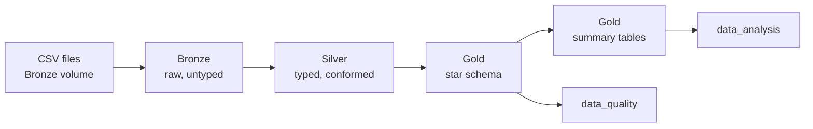
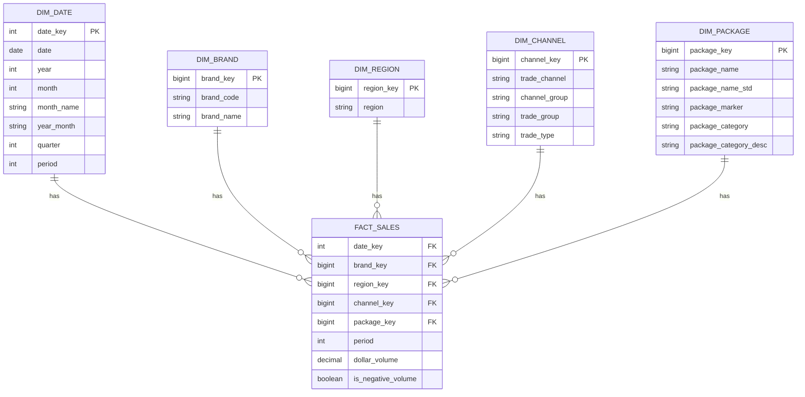
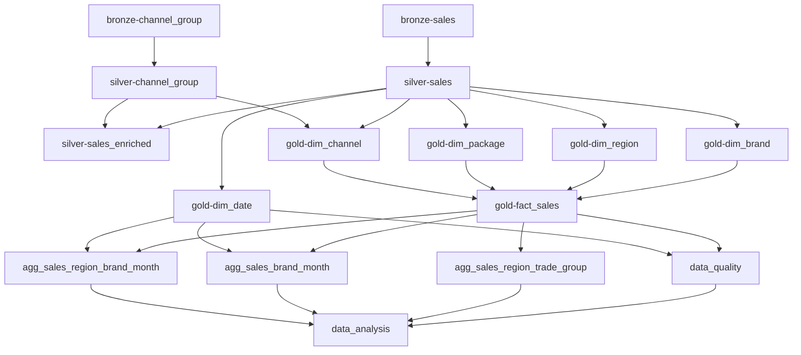

# Beverage Sales Data Pipeline

This project implements a Databricks data engineering pipeline for the AB InBev
Business Case, using two source files:

- `abi_bus_case1_beverage_sales_20210726.csv`
- `abi_bus_case1_beverage_channel_group_20210726.csv`

The solution was built using PySpark, Delta tables, Medallion Architecture,
Lakeflow Jobs orchestration, and a Gold-layer dimensional model based on a star
schema approach.

## Project Goals

The case defines four requirements:

1. Merge the beverage channel features with the transactional sales.
2. Implement a dimensional model with dimensions, a fact, and summary tables,
   with 100% of the provided data ingested.
3. Describe the next steps and enhancements after the MVP.
4. Answer the following business questions from the model, not from the source
   files:
   - 4.1 What are the Top 3 Trade Groups for each Region in sales?
   - 4.2 How much sales did each brand achieve per month?
   - 4.3 Which is the lowest brand in sales for each Region?

The answers are implemented in `data_analysis.py` and are calculated using only
the curated Gold-layer tables.

## Architecture Overview

The project follows the Medallion Architecture:



### Setup Notebook

A setup notebook creates the Databricks resources required before the pipeline
runs:

- The `beverage_sales` catalog
- The `bronze`, `silver`, and `gold` schemas
- The `beverage_sales.bronze.raw_data` volume that holds the source files

This makes the project reproducible and avoids manual resource creation in the
Databricks UI.

## Source Files

The two files are delivered with the challenge rather than published at a URL,
so they are placed directly in the Bronze volume:

```text
/Volumes/beverage_sales/bronze/raw_data/
```

The pipeline therefore starts at the Bronze layer. Both Bronze notebooks record
`source_dir` and `source_file` from the Spark `_metadata` column, so every row
can be traced back to the file it came from even though the landing step is
manual. Automating that landing step is listed under next steps.

## Source Data Findings

Profiling the files before modeling them surfaced four issues that would
otherwise be silent.

**The sales file is not a comma separated CSV.** It is UTF-16 LE, tab
delimited, with CRLF line endings. Reading it with `encoding = UTF-16` alone
returns 32,304 rows instead of 16,151, because every line is split twice, and
Spark raises no error. The combination that parses correctly is:

```python
.option('sep', '\t')
.option('encoding', 'UTF-16LE')
.option('lineSep', '\r\n')
```

**Both files carry a byte order mark** that leaks into the first column name as
`\ufeffDATE`. Supplying an explicit schema together with `header = True` avoids
it, because the header line is skipped and the names come from the schema.

**Every `BRAND_NM` value has a leading space** (`' LEMON'`), which survives into
the GROUP BY if it is not trimmed.

**`TSR_PCKG_NM` has case drift and trailing markers**: `20Z NRP 24L`,
`20z NRP 24L S`, `.591L NRP 24L`, `.591L NRP 24L *`. Eight raw values normalize
to three.

Other characteristics worth stating: 16,151 rows covering 13 dates between
January and March 2006, 4 brands, 7 regions, 31 trade channels, 3 package
categories, and a total of 4,348,925.16 in dollar volume. 260 rows carry a
negative dollar volume. They are kept and flagged, but the flag is deliberately
technical: the source does not say whether they are returns, credits, reversals
or corrections, so the model does not claim to know.

## Medallion Layers

### Bronze Layer

The Bronze layer stores the source data as Delta tables with minimal
transformation.

```text
beverage_sales.bronze.sales
beverage_sales.bronze.channel_group
```

Main decisions:

- Explicit schemas are used instead of relying on schema inference.
- Every column is landed as a string. Casting belongs to Silver, so a malformed
  value can never be silently turned into a null at ingestion time.
- `source_dir`, `source_file`, and `ingestion_timestamp` are added to support
  traceability.

### Silver Layer

The Silver layer cleans and conforms the data without aggregating it and
without losing rows.

```text
beverage_sales.silver.sales
beverage_sales.silver.channel_group
beverage_sales.silver.sales_enriched   (view)
```

Main transformations:

- Source column names are renamed to business names, for example
  `btlr_org_lvl_c_desc` becomes `region` and `tsr_pckg_nm` becomes
  `package_name`.
- All text keys are trimmed and uppercased before they are ever used as join
  keys.
- `dollar_volume` is cast to `decimal(18,2)`.
- The raw package name is kept as the package business key, and the normalized
  form and the marker are exposed as the separate attributes `package_name_std`
  and `package_marker`, so nothing from the source is destroyed.
- `is_negative_volume` flags the 260 negative rows without naming what they
  mean. So, the flag stays technical until the business confirms one.
- `sales_enriched` is a view that joins the sales to the channel mapping. See
  "Requirement 1 stated twice" below.
- Before `dropDuplicates` is used on a natural key, an assertion checks that the
  key really does determine the remaining attributes. A future file with a
  conflicting mapping fails visibly instead of keeping an arbitrary row.

### Gold Layer

The Gold layer implements the dimensional model used for reporting and
analytics.

```text
beverage_sales.gold.dim_date
beverage_sales.gold.dim_brand
beverage_sales.gold.dim_region
beverage_sales.gold.dim_channel
beverage_sales.gold.dim_package
beverage_sales.gold.fact_sales

beverage_sales.gold.agg_sales_region_trade_group
beverage_sales.gold.agg_sales_brand_month
beverage_sales.gold.agg_sales_region_brand_month
```

The business questions are answered from these Gold tables only.

## Why Star Schema?

A star schema was selected because it is a strong fit for analytical workloads,
dashboards, and BI tools such as Power BI and Tableau.

This modeling approach makes the data easier to consume because it separates
descriptive entities, such as region, brand, channel, package, and date, from
the measurable sales facts.

Benefits of this approach:

- Easier dashboard implementation
- Clear separation between facts and dimensions
- Better support for slicing and filtering by region, brand, channel, package,
  month, and trade group
- Easier reuse of the same curated Gold tables for multiple analyses
- More understandable model for business users and BI developers

## Dimensional Model

The central fact table is `fact_sales`, which has the grain:

```text
One row per date, brand, region, trade channel and package
```

That combination was verified to be unique across all 16,151 source rows, so the
fact is loaded one row per source row, with no aggregation and no row
collapsing.

This is not transaction grain, and the model does not describe it as such. The
source carries no transaction identifier, so each row is already a total over an
unknown number of underlying sales. For the same reason the summary tables count
`record_count` rather than a transaction count.

The dimensions provide descriptive context:

- `dim_date`: date, year, month, month name, quarter, and period
- `dim_brand`: brand code and brand name
- `dim_region`: bottler region
- `dim_channel`: trade channel, channel group, trade group, and trade type
- `dim_package`: package name, normalized name, marker, and package category

No bridge table is required here. Every descriptive attribute in this dataset
resolves to exactly one value per fact row, so all five relationships are simple
one to many.

## ER Diagram



## Gold Table Design Decisions

### Requirement 1 stated twice

Requirement 1 asks for the channel features to be merged with the transactional
sales. The merge is resolved physically in `dim_channel`, for the reasons below.

Because the case states the requirement in terms of the sales rather than the
model, `silver.sales_enriched` also states it directly as a view over
`silver.sales` and `silver.channel_group`. The view duplicates no data and
cannot drift from its sources, so the requirement is visible without having to
reconstruct it from the star schema.

### The channel merge belongs to the dimension

Requirement 1 asks for the channel features to be merged with the transactional
sales. That merge is resolved in `dim_channel`, not against the fact table.

`trade_group` and `trade_type` are attributes of the channel, so they are joined
once against 31 rows while the dimension is built.

`chnl_group` was verified to be a strict one to one rollup of
`trade_chnl_desc`, so it is stored as an attribute of the same dimension rather
than becoming a separate hierarchy.

### Deterministic Surrogate Keys

The dimension keys are `BIGINT`, generated as `abs(xxhash64(business key))`
instead of non-deterministic IDs.

Examples:

- `brand_key` is generated from `brand_code`
- `channel_key` is generated from `trade_channel`
- `date_key` uses the `yyyyMMdd` format

Two properties matter here. The hash is deterministic, so the same source value
always produces the same surrogate key: dimension keys stay stable across runs
and a dimension reload never orphans facts that already point at it. And the
keys are numeric rather than hex strings, which is the lighter physical choice
for a column that exists only to be joined and stored on every fact row.

Taking the absolute value keeps every generated key non negative, which is what
makes `-1` safe to reserve for the UNKNOWN member: no real business key can ever
collide with it.

### Unknown Members and Left Joins

Every dimension carries an UNKNOWN member keyed `-1`, and the fact resolves its
keys with left joins and a `coalesce` fallback to that value.

Inner joins would be shorter, but they would silently drop facts whenever a
dimension is incomplete, which is exactly what the "100% of data ingested"
requirement is asking about. With the current files nothing falls through, and
the data quality notebook asserts that.

### Broadcast Joins

The largest dimension has 32 rows, so every lookup in `fact_sales` is wrapped in
`F.broadcast`. The fact build is a single map-side pass with no shuffle.

### Full Calendar Instead of Observed Dates

`dim_date` is generated for the full years covered by the fact rather than from
the 13 distinct dates present in the file, so it stays valid when new extracts
arrive. The source `PERIOD` column is the week within the month, and the derived
`ceil(day / 7)` was verified to match it on every row.

### Summary Tables

Three summary tables were built, one per business question. They keep the
analysis queries small and give BI consumers a stable, pre-aggregated surface,
while the fact table stays available for anything unanticipated.

## Data Quality and Reconciliation

`data_quality.py` runs after the Gold layer and fails the job if any check
drifts. The checks compare the layers against each other and hold for any extract. 
The acceptance baselines are the fixed row count and dollar volume of this
recruitment extract: they prove this delivery is complete, but a new file would
change them legitimately, so they are not general rules.

It reports:

- Row count and dollar volume for Bronze, Silver, and Gold
- Fact rows resolving to an `UNKNOWN` dimension member
- Duplicates on the declared fact grain
- The derived calendar period against the period supplied in the file

## Lakeflow Jobs Orchestration

The pipeline is orchestrated with Lakeflow Jobs. The job can be generated by
running:

`setup/create_lakeflow_job.py`

The dependency order is:



The analysis task depends on the data quality task as well as on the summary
tables, so the answers are only produced after the model has been proven
complete.

## Data Analysis Notebook

The answers are available in `data_analysis.py`, which reads from the Gold layer
only.

## Next Steps and Future Enhancements

Requirement 3 of the case. These are the items I would take on after the MVP,
roughly in the order I would do them.

**Ingestion**

- Add an automated landing step once the files come from a system rather than a
  manual upload: a parameterized task that pulls from SFTP, an API, or object
  storage into the Bronze volume.
- Switch the Bronze reads to Auto Loader with schema evolution, so new files are
  picked up incrementally and unexpected columns are captured instead of
  dropped.
- Replace the full overwrite with an idempotent `MERGE` on a row hash, so a
  reprocessed file updates in place instead of duplicating.
- Add a rejected-records table for rows that fail the Silver casts, rather than
  relying on assertions alone.

**Modeling**

- Type 2 history on the dimensions. The current files contain no history, so
  Type 1 is honest for the MVP, but region and channel attributes will change.
- Confirm with the business whether the `S` and `*` package markers are
  promotional flags.

**Performance**

- Partition `fact_sales` by `year_month` and apply liquid clustering on region
  and brand. At 16,151 rows this is deliberately not done yet, since partitioning
  a small table only creates small-file overhead. It becomes necessary somewhere
  around the hundreds of millions of rows.
- Enable liquid clustering on fact_sales, keyed on the columns the queries actually
  filter and join on: CLUSTER BY (date_key, region_key, brand_key).
- Schedule `OPTIMIZE` and `VACUUM`, and enable predictive optimization.

**Governance and reliability**

- Unity Catalog lineage, table and column comments, and row filters by region.
- Move the data quality checks into Lakeflow expectations or a DLT pipeline, and
  publish the results to a monitoring dashboard rather than only failing the job.
- Unit tests on the transformation functions plus CI/CD through Databricks Asset
  Bundles, so the notebooks are deployed rather than copied.

**Analytics**

- A Databricks SQL dashboard or Power BI semantic model over the summary tables.
- Additional measures the current source cannot support yet: unit volume,
  discount, and net revenue, which would allow price per case and mix analysis.
- Forecasting on top of `agg_sales_brand_month` once more than three months of
  history is available.

## Project Structure

```text
abinbev_challenge/
  setup/
    create_resources.py
    create_lakeflow_job.py

  bronze/
    bronze_sales.py
    bronze_channel_group.py

  silver/
    silver_sales.py
    silver_channel_group.py
    sales_enriched.py

  gold/
    dim_date.py
    dim_brand.py
    dim_region.py
    dim_channel.py
    dim_package.py
    fact_sales.py
    agg_sales_region_trade_group.py
    agg_sales_brand_month.py
    agg_sales_region_brand_month.py

  data_quality.py
  data_analysis.py
```

## Summary

This project implements a complete PySpark pipeline on Databricks using Delta
tables. It organizes the data with the Medallion Architecture, resolves the
channel merge inside the channel dimension where it belongs, exposes a Gold star
schema with three summary tables designed for BI, and proves the "100% ingested"
requirement with a reconciliation notebook that fails the job when the numbers
drift.

The final answers are intentionally based only on the Gold layer, to simulate a
real production analytics architecture where users should not query raw or
intermediate data directly.
